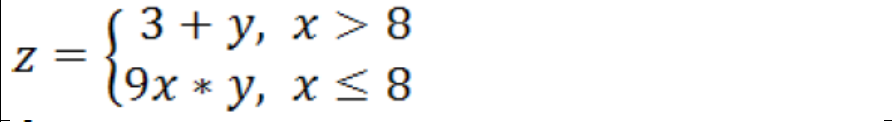

# Лабораторна робота №1

# Тема: Налаштування середовища розробки програм мовою Python.

# Завдання

Обчислити вираз. Дані вводяться користувачем у консолі Python (за
допомогою input()). Передбачити можливі помилки, вивести відповідне
повідомлення:

# Опис Фцнкціональних вимог:

Функція отримує вхідні данні x та y та в залежності від
того чи більше 8-и x выконуэ одне з двох рівнянь.

На вихід подаеться результат обчислень одного з рівнянь z.

# Приклад вхідних даних:
x = 5; y = 2;

На вхід подаються два числа (int)
